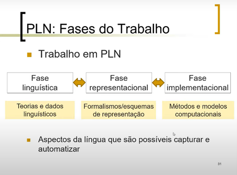

# Anotações da Aula 2
## Diferença entre Linguagem e Língua
- Linguagem: capacidade de troca de informações pelos humanos, pode conter o verbal ou não
- Língua: código de comunicação utilizado por uma sociedade
> Libras, Inglês...

Para PLN, tanto linguagem como língua está certo. Pois, apesar do sentido estar mais próximo de línguas, a tradução oficial da área para o português é com linguagem

PLN nasceu durante a segunda guerra mundial, junto com o chamado "Pai da Computação"

O curso será focado em semântica, morfologia e Sintaxe

## Fases da formação do modelo

1. Fase linguística
2. Fase representacional
3. Fase implementacional

Córpus --> Sinônimo de Dataset em PLN